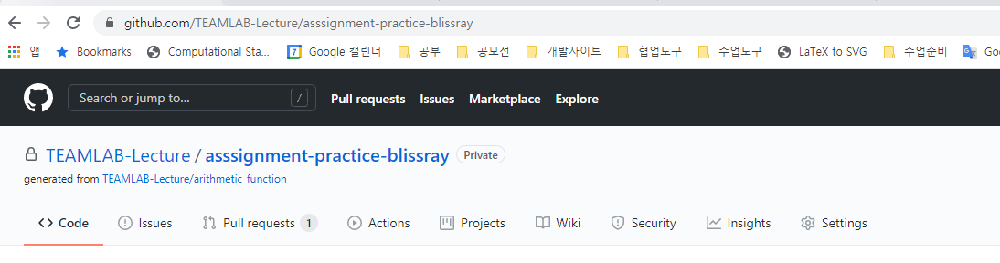
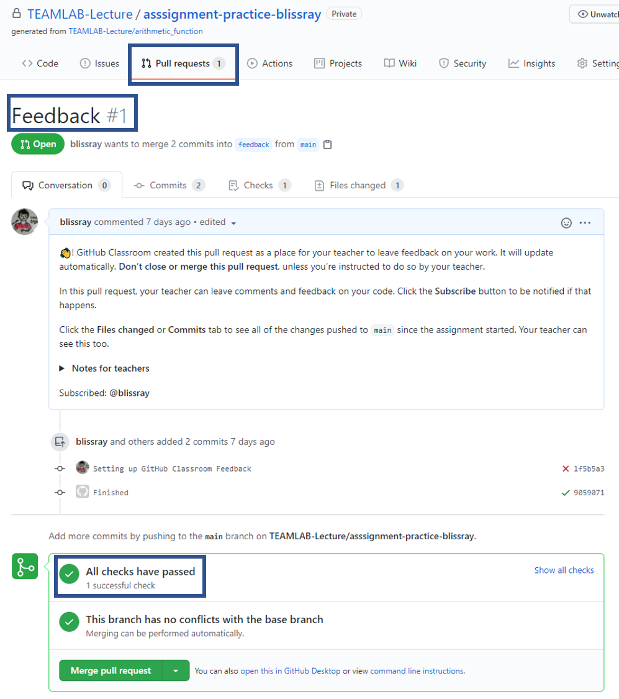

# Homework - Text Processing II

## 개요

본 과제에서는 이전 과제에 이어서 string 다루는 방법을 학습합니다. 다른 자료구조를 필요시에 사용하시면 됩니다. 본 과제에서 풀어야 할 문제는 아래 2가지가 있습니다.

## 숙제 다운로드 방법
1. 아래링크를 클릭하여 숙제 github repository를 복사함
   - [https://classroom.github.com/a/wYqGmNUr](https://classroom.github.com/a/wYqGmNUr)
2. 아래 코드를 사용하여 숙제 코드 github repository를 자신의 컴퓨터로 클론함
    ```
    git clone <레포지토리 URL>
    ```
    
3. 해당 폴더로 이동하여 자신의 코드를 수정함

## 함수 리스트

- digits_to_words

```
인풋으로 받는 스트링에서 숫자만 추출하여 영어 단어로 변환하여 단어들이 연결된 스트링을 반환함
아래의 요건들을 충족시켜야함
* 반환하는 단어들은 영어 소문자여야함
* 단어들 사이에는 띄어쓰기 한칸이 있음
* 만약 인풋 스트링에서 숫자가 존재하지 않는 다면, 빈 문자열 (empty string)을 반환함

    Parameters:
        input_string (string): 영어로 된 대문자, 소문자, 띄어쓰기, 문장부호, 숫자로 이루어진 string
        ex - "Zip Code: 19104"

    Returns:
        digit_string (string): 위 요건을 충족시킨 숫자만 영어단어로 추출된 string
        ex - 'one nine one zero four'

    Examples:
        >>> import text_processing2 as tp2
        >>> digits_str1 = "Zip Code: 19104"
        >>> tp2.digits_to_words(digits_str1)
        'one nine one zero four'
        >>> digits_str2 = "Pi is 3.1415..."
        >>> tp2.digits_to_words(digits_str2)
        'three one four one five'
```

- to_camel_case
```
컴퓨터 프로그래밍에 많은 명명 규칙이 있지만, 두 규칙이 특히 흔히 쓰입니다. 
첫번째로는, 변수 이름을 'underscore'로 나눠준다거나, (ex. under_score_variable)
두번째로는, 변수 이름을 대소문자 구별해 구분자 (delimiter)없이 쓰는 경우가 있습니다. 
이 두번째의 경우에는 첫번째 단어는 소문자로, 그 후에 오는 단어들의 첫번째 글자들은 대문자로 쓰입니다 (ex. camelCaseVariable). 

이 문제에서 첫번째 규칙 'underscore variable' 에서 두번째 규칙 'camelcase variable'으로 변환함
* 앞과 뒤에 여러개의 'underscore'는 무시해도 된
* 만약 어떤 변수 이름이 underscore로만 이루어 진다면, 빈 문자열만 반환해도 됨

    Parameters:
        underscore_str (string): underscore case를 따른 스트링

    Returns:
        camelcase_str (string): camelcase를 따른 스트링

    Examples:
        >>> import text_processing2 as tp2
        >>> underscore_str1 = "to_camel_case"
        >>> tp2.to_camel_case(underscore_str1)
        'toCamelCase'
        >>> underscore_str2 = "__EXAMPLE__NAME__"
        >>> tp2.to_camel_case(underscore_str2)
        'exampleName'
```

## 제출방법
1. 숙제 코드를 수정한 후 commit 수행
   ```
   git add *.py
   git commit -m "Update my code"
   ```
2. 자신의 code repository에 코드를 push함
    ```
    git push origin main
    ```
3. 자신의 코드가 all pass를 받았는지 확인함
    